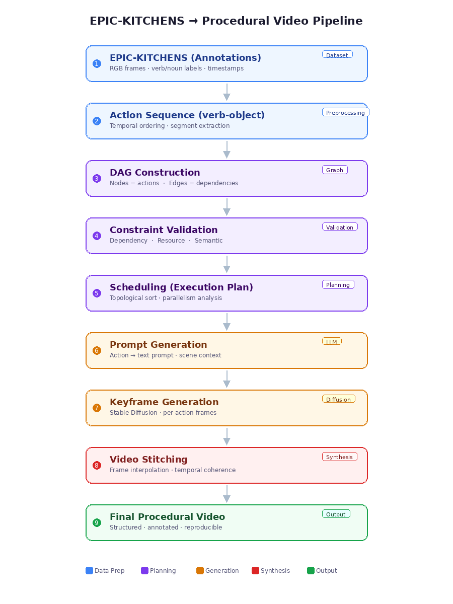

<!-- ## 🍜 CAPEA: Constraint-Aware Procedural Execution Agent
CAPEA is an advanced AI agent designed to bridge the gap between high-level natural language instructions and logically grounded, multi-stage visual simulations. It doesn't just "generate videos"—it understands constraints, plans resources, and executes a full cooking pipeline from a first-person perspective.

<br>

### 🚀 Key Novelties
This project introduces a Constraint-Aware Procedural Execution Agent that bridges the gap between natural language understanding and logical visual generation.

1. Constraint-Aware Reasoning & Planning
Unlike standard Text-to-Video models that generate visuals without logical grounding, this agent performs Resource-Aware Scheduling.

    - Graph-Based Logic: Converts unstructured instructions into a Directed Acyclic Graph (DAG) of actions.
    - Feasibility Verification: Automatically calculates temporal and resource constraints (e.g., "Cannot fry an egg while the only stove is occupied by boiling water").
    - Execution Validation: Ensures that the generated sequence is physically and logically executable in a real-world environment.


2. Multi-Stage Generative Pipeline (T2I2V)
To overcome hardware limitations and ensure visual consistency, the system implements a sophisticated Chained Generative Pipeline.

    - Visual Consistency: By generating a high-fidelity Keyframe (T2I) first and then animating it (I2V), the agent maintains object permanence (e.g., preventing an onion from morphing into a potato mid-video).
    - Hardware Optimization: Implements an advanced Memory-Swap & Sequential Offloading mechanism to run large-scale Diffusion models on consumer-grade hardware (11GB VRAM).


3. Procedural Task Agent Architecture
The system is designed as an End-to-End Agent, not just a creative tool.

    - Extensibility: The structured Action Graph output can be directly interfaced with robotic operating systems (ROS) or IoT-enabled smart kitchens.
    - Multimodal Alignment: Synchronizes textual instructions, logical timelines, and visual evidence into a single cohesive output.

<br>

### 🏗️ System Architecture
1. Instruction Parsing: LLM-based extraction of actions and resources.
2. Logic Engine: DAG construction and resource conflict resolution.
3. Keyframe Stage: Stable Diffusion v1.5 generating 1st-person POV images.
4. Animation Stage: Stable Video Diffusion (SVD) transforming frames into 14-frame video clips.
5. Final Synthesis: Concatenation of clips into a full procedural demonstration.

<br>

### 🚀 Getting Started
Prerequisites
- Python 3.10+
- NVIDIA GPU with 11GB+ VRAM (e.g., RTX 2080 Ti)
- OpenAI API Key

<b>Installation<b>
```Bash
git clone https://github.com/shinnew9/Constraint-AwareProceduralExecutionAgent.git
cd CAPEA
python3 -m venv .venv
source .venv/bin/activate
pip install -r requirements.txt
```

<b>Usage<b>
```Bash
export OPENAI_API_KEY='your_key_here'
python3 main.py
```

<br>

### 📊 Visual Outputs
<b>Execution Timeline<b>
CAPEA generates a visual Gantt-style chart (timeline.png) to show the logical flow of actions.
<br>
1st-Person Simulation (Dish: Ramen)
The final output consists of 5 sequential video clips representing the full "Ramen Preparation" pipeline:

1. Chop Onions (POV)
2. Boil Water (POV)
3. Add Noodles (POV)
4. Fry Egg (POV)
5. Serve Dish (Final Result)

<br>

### 📊 Mid-term Progress Report
#### 1. Current Development Status
| Phase | Task | Status | Details |
| :--- | :--- | :--- | :--- |
| **Phase 1** | **Logic Engine** | **Completed** | Successfully parsing instructions into Constraint-Aware DAGs. |
| **Phase 2** | **Scheduling** | **Completed** | Resource conflict resolution and temporal timeline generation. |
| **Phase 3** | **Baseline Pipeline** | **Completed** | E2E flow from Text to 1st-person POV Video (T2I2V) is operational. |
| **Phase 4** | **Data Engineering** | **In Progress** | Acquiring and preprocessing Top-down POV datasets (EPIC-KITCHENS/YouCook2). |
| **Phase 5** | **Optimization** | **Pending** | Integration of Custom LoRA to ensure visual consistency and realism. |

#### 2. Technical Milestones Achieved
* **Dynamic Resource Scheduling**: Implemented a scheduling logic that prioritizes stove-top tasks (e.g., boiling water) while parallelizing preparation tasks (e.g., chopping).
* **1st-Person Perspective Optimization**: Refined prompt engineering to maintain a consistent "Top-down POV" across all generated visual assets.
* **Memory-Efficient Architecture**: Developed a sequential VRAM management system to run heavy diffusion models on 11GB hardware (RTX 2080 Ti).

### 3. Future Roadmap (Post Mid-term)
* **Custom LoRA Fine-tuning**: We are currently curating a high-resolution "Top-down POV" culinary dataset. This will be used to train a domain-specific LoRA to ensure the environment (kitchen, lighting, tools) remains consistent across all simulation steps.
* **Enhanced Visual Fidelity**: Transitioning from generic food images to professional-grade culinary simulation outputs.
* **Instruction-to-Action Accuracy**: Improving the alignment between natural language nuances and the final generated video frames.

<br>

### 🛠️ Technical Stack
- Language Models: OpenAI GPT-4o
- Generative Models: Stable Diffusion v1.5, Stable Video Diffusion (SVD)
- Logic & Graphics: NetworkX, Matplotlib
- Video Processing: MoviePy, OpenCV

<br>

### 👤 Author
Yoojin Shin <br>
Lehigh University <br>
Department of Computer Science & Engineering
-->


<!--
# 🍳 CAPEA: Constraint-Aware Procedural Execution Agent

> **A structured generation system that converts natural instructions into executable action graphs under temporal and resource constraints, verifies feasibility via simulation, and visualizes execution.**

[](https://opensource.org/licenses/MIT)
[](https://www.python.org/downloads/)
[](https://pytorch.org/)

## 📖 Overview

With recent advancements in Large Language Models (LLMs) and Diffusion models, text-to-video generation has made significant progress. However, in procedural tasks like "cooking" that require strict causal relationships and physical constraints, models often produce **logical hallucinations** (e.g., using the same burner simultaneously for multiple tasks, or frying uncut ingredients).

**CAPEA** is a bottom-up video generation framework that goes beyond mere "plausibility" to guarantee **"feasibility"** in real-world environments. It parses natural language instructions into structured Directed Acyclic Graphs (DAGs), simulates resource and temporal constraints in advance, and renders only the validated, conflict-free plans into video sequences.

## ✨ Key Features

1. **Instruction Parsing (Language to DAG)**
   * Converts unstructured natural language recipes into a formal Directed Acyclic Graph (DAG) where nodes are defined as $v_i = (Action, Object, Resource, Duration)$.
2. **Constraint Validation**
   * **Dependency Constraint:** Ensures tasks are executed in the correct causal sequence.
   * **Resource Constraint:** Prevents the simultaneous use of shared resources (e.g., pans, burners).
   * **Semantic Constraint:** Filters out invalid or impossible action-object pairs.
3. **Resource-Aware Scheduling**
   * Assigns timestamps to actions to minimize the overall makespan while strictly adhering to all validated constraints.
4. **T2I2V Visual Synthesis**
   * Generates high-quality keyframes based on the validated DAG schedule and renders logically coherent procedural video clips using a video diffusion engine.

## ⚙️ System Pipeline
-->

<!--```mermaid
graph TD;
    A[Natural Language Instructions] -> B[LLM DAG Parser];
    B -> C{Constraint Validator};
    C - Dependency/Resource/Semantic -> D[Resource-Aware Scheduler];
    D -> E[Text-to-Image Keyframe Gen];
    E -> F[Video Generation Engine];
    F -> G[Coherent & Executable Video];
-->


<h1>CAPEA: Constraint-Aware Procedural Execution Agent</h1>

<p>
CAPEA is a constraint-aware procedural execution framework that transforms structured action sequences into executable plans and visual outputs.
</p>

<hr>

<h2>📌 Project Overview</h2>

<p>
Modern generative models such as large language models and diffusion models can generate highly plausible procedural outputs. However, they often fail to ensure that these outputs are <strong>executable</strong> due to missing constraints such as resource conflicts, incorrect temporal ordering, or invalid actions.
</p>

<p>
CAPEA addresses this limitation by enforcing execution constraints <strong>before generation</strong>. The system guarantees that all generated outputs correspond to feasible execution plans.
</p>

<ul>
  <li>Convert action sequences into Directed Acyclic Graphs (DAGs)</li>
  <li>Validate dependency, resource, and semantic constraints</li>
  <li>Generate executable schedules</li>
  <li>Produce prompts for visual generation</li>
  <li>Generate keyframes and compose procedural videos</li>
</ul>

<p align="center">
  
</p>


<hr>

<h2>📊 Data Source</h2>

<p>
This project uses the <strong>EPIC-KITCHENS</strong> dataset.
</p>

<ul>
  <li><a href="https://epic-kitchens.github.io/">EPIC-KITCHENS Website</a></li>
  <li><a href="https://github.com/epic-kitchens/epic-kitchens-100-annotations">Annotation Repository</a></li>
</ul>

<p>
Only annotation files are used:
</p>

<ul>
  <li>EPIC_100_train.csv</li>
  <li>EPIC_100_validation.csv</li>
</ul>

<p>
These annotations provide structured verb-object pairs that are converted into procedural graphs.
</p>

<hr>

<h2>🧠 Method</h2>

<p>
CAPEA represents procedural tasks as a Directed Acyclic Graph:
</p>

<pre><code>G = (V, E)</code></pre>

<p>
Each node is defined as:
</p>

<pre><code>v_i = (action, object, resource, duration)</code></pre>

<p>
Constraints include:
</p>

<ul>
  <li><strong>Dependency constraint</strong>: ensures correct execution order</li>
  <li><strong>Resource constraint</strong>: prevents overlapping resource usage</li>
  <li><strong>Semantic constraint</strong>: validates action-object pairs</li>
</ul>

<p>
Scheduling is performed to minimize execution time while satisfying all constraints.
</p>

<hr>

<h2>⚙️ Model Selection</h2>

<p>
CAPEA is designed as a modular system rather than a single trained model.
</p>

<ul>
  <li><strong>Constraint reasoning</strong>: rule-based DAG + validation</li>
  <li><strong>Scheduling</strong>: constraint-aware execution planning</li>
  <li><strong>Visual generation</strong>: Stable Diffusion</li>
</ul>

<p>
This separation allows CAPEA to guarantee execution feasibility independently from the generative model.
</p>

<hr>

<h2>📈 Evaluation</h2>

<p>
Instead of traditional accuracy metrics, CAPEA is evaluated based on execution feasibility:
</p>

<ul>
  <li><strong>Semantic Validity</strong>: correctness of action-object pairs</li>
  <li><strong>Resource Conflicts</strong>: overlapping resource usage</li>
  <li><strong>Temporal Violations</strong>: incorrect execution order</li>
  <li><strong>Execution Success</strong>: whether a valid schedule is produced</li>
</ul>

<p>
Results:
</p>

<ul>
  <li>✔ 100% semantic validity</li>
  <li>✔ 0 resource conflicts</li>
  <li>✔ 0 temporal violations</li>
  <li>✔ 100% execution success</li>
</ul>

<p>
These results demonstrate that constraint-aware validation significantly improves procedural reliability.
</p>

<hr>

<h2>🚀 How to Run</h2>

<h3>1. Convert dataset to graph</h3>

<pre><code>PYTHONPATH=src python src/capea/data/epic_adapter.py \
--csv data/datasets/epic/EPIC_100_train.csv \
--output data/examples/epic_window_0.json
</code></pre>

<h3>2. Validate and evaluate</h3>

<pre><code>PYTHONPATH=src python src/scripts/run_validation_demo.py data/examples/epic_window_0.json
</code></pre>

<h3>3. Generate prompts</h3>

<pre><code>PYTHONPATH=src python src/scripts/run_prompt_demo.py data/examples/epic_window_0.json
</code></pre>

<h3>4. Generate keyframes</h3>

<pre><code>PYTHONPATH=src python src/scripts/run_sd_keyframes.py \
--prompts outputs_json/prompts/epic_window_0_prompts.json
</code></pre>

<h3>5. Generate video</h3>

<pre><code>PYTHONPATH=src python src/scripts/run_clip_demo.py
PYTHONPATH=src python src/scripts/run_stitch_demo.py
</code></pre>

<hr>

<h2>📂 Project Structure</h2>

<pre><code>src/
  capea/
    logic/
    execution/
    visual/
    evaluation/
  scripts/

data/
outputs_json/
</code></pre>

<hr>

<h2>⚠️ Limitations</h2>

<ul>
  <li>No real-world physical execution</li>
  <li>Relies on predefined constraints</li>
  <li>Limited to short procedural sequences</li>
  <li>Depends on annotated data</li>
</ul>

<hr>

<h2>🎯 Summary</h2>

<p>
CAPEA demonstrates that enforcing constraints prior to generation is critical for building reliable procedural systems.
</p>

<p>
Instead of generating only plausible outputs, CAPEA ensures that all outputs are executable.
</p>
